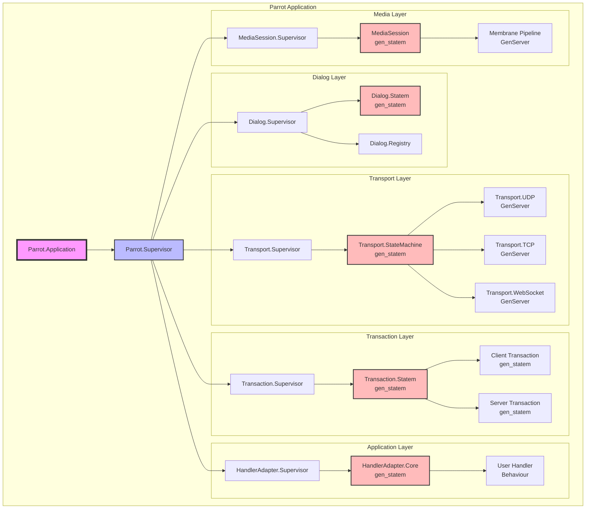
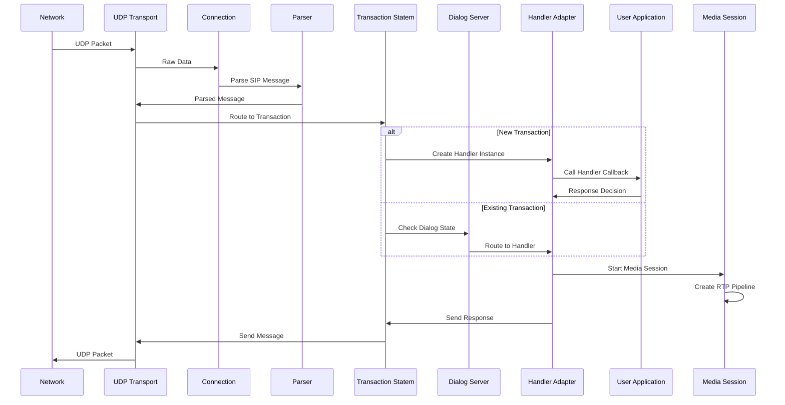
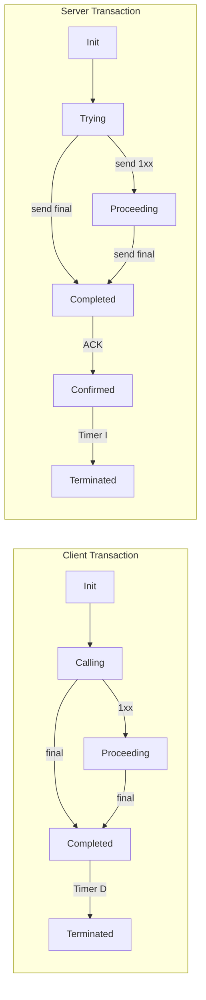
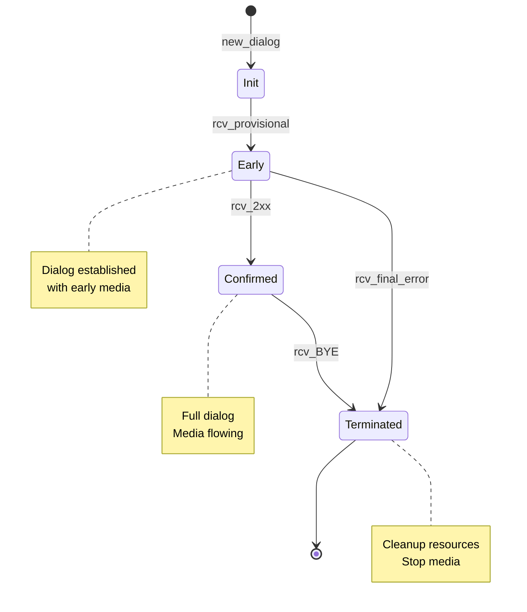
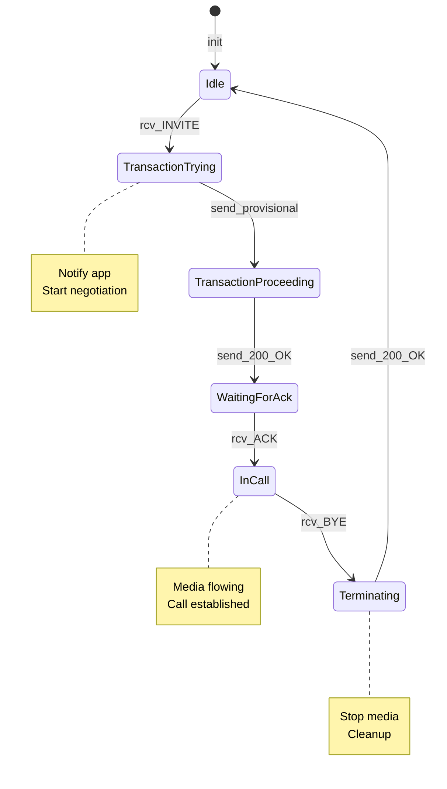
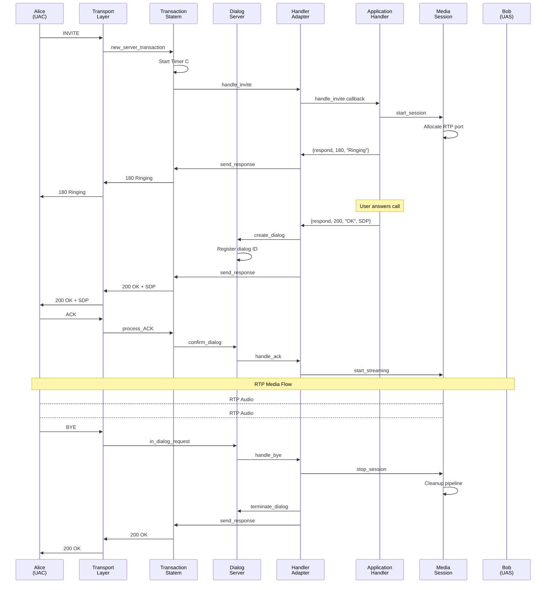
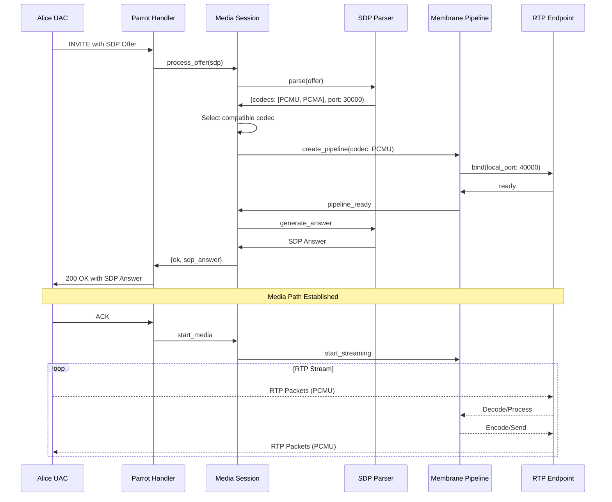
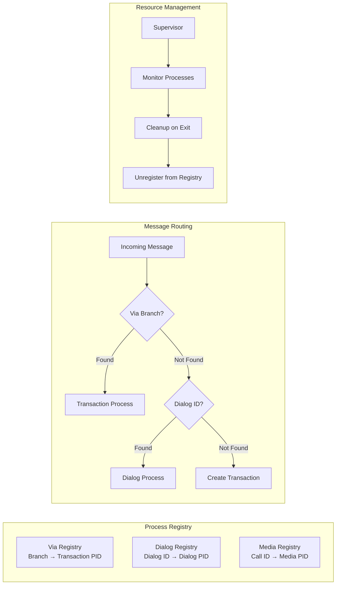
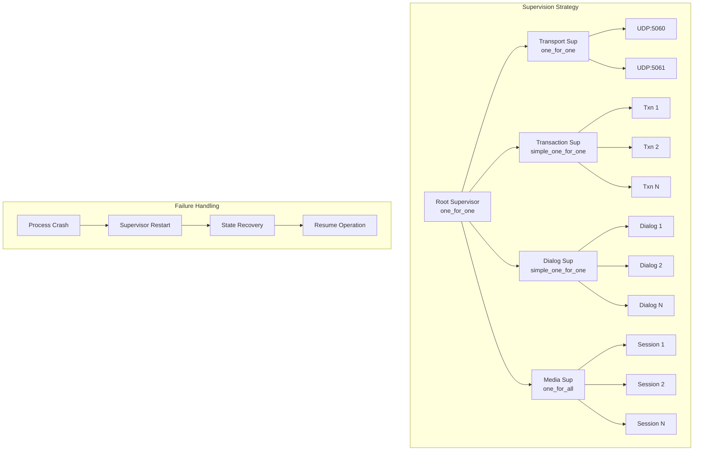

# Architecture

This guide provides a comprehensive overview of Parrot's architecture, including process supervision trees, state machines, and message flows.

The architecture follows the SIP protocol specification defined in [RFC 3261](https://www.rfc-editor.org/rfc/rfc3261.html) and related RFCs.

## System Architecture Overview

## Process Communication Flow

## State Machine: Transaction Layer

The transaction state machines are implemented according to [RFC 3261 Section 17](https://www.rfc-editor.org/rfc/rfc3261.html#section-17):

## State Machine: Dialog Layer

Dialog state management follows [RFC 3261 Section 12](https://www.rfc-editor.org/rfc/rfc3261.html#section-12):

## State Machine: Handler Adapter

## SIP Call Flow with Process Interaction

This flow demonstrates how Parrot implements the basic call flow from [RFC 3665 Section 3.1](https://www.rfc-editor.org/rfc/rfc3665.html#section-3.1):

## Media Negotiation Flow

## Process Registry and Discovery

## Fault Tolerance and Supervision

## Performance Characteristics

The architecture is designed for:

- **High Concurrency**: Each call/transaction in its own process
- **Fault Isolation**: Crashes don't affect other calls
- **Scalability**: Distribute across nodes
- **Low Latency**: Direct process messaging
- **Resource Efficiency**: Processes cleaned up after use

## Key Design Decisions

1. **gen_statem over GenServer**: For complex protocol state machines
2. **Process per Transaction**: Isolation and garbage collection
3. **Registry-based Discovery**: Fast process lookup
4. **Supervision Trees**: Automatic recovery from failures
5. **Layered Architecture**: Clear separation of concerns

## Integration Points

- **SIP Handler Behavior**: Implement `Parrot.SipHandler` callbacks for SIP protocol events
- **Media Handler Behavior**: Implement `Parrot.MediaHandler` callbacks for media session control
- **Transport Plugins**: Add new transport protocols beyond UDP
- **Codec Support**: Extend with additional audio/video codecs

## Handler Architecture

### UasHandler
The `Parrot.UasHandler` behaviour provides callbacks for SIP protocol events as a User Agent Server:
- `handle_invite/2` - Process incoming calls
- `handle_ack/2` - Handle call confirmation
- `handle_bye/2` - Handle call termination
- `handle_cancel/2` - Handle call cancellation
- Transaction state callbacks for fine-grained control

### MediaHandler
The `Parrot.MediaHandler` behaviour provides callbacks for media control:
- `init/1` - Initialize handler state
- `handle_session_start/3` - Media session lifecycle
- `handle_stream_start/3` - Begin media streaming
- `handle_play_complete/2` - Audio playback events
- `handle_codec_negotiation/3` - Influence codec selection
- `handle_rtp_stats/2` - Monitor call quality
- `handle_stream_error/3` - Error recovery

Both handlers work together to provide complete control over SIP calls and their associated media streams.