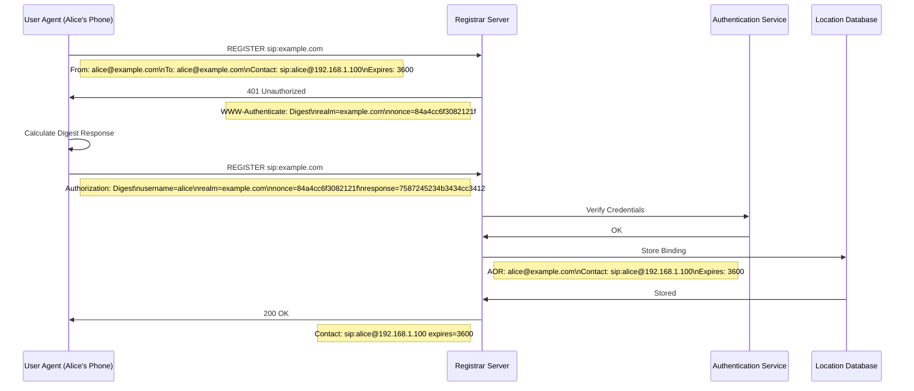
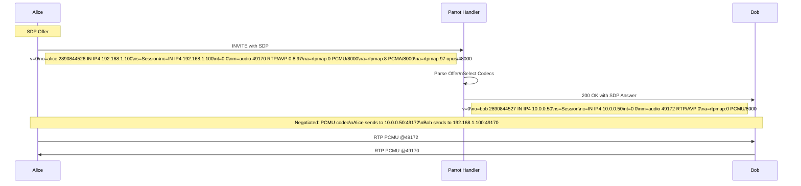
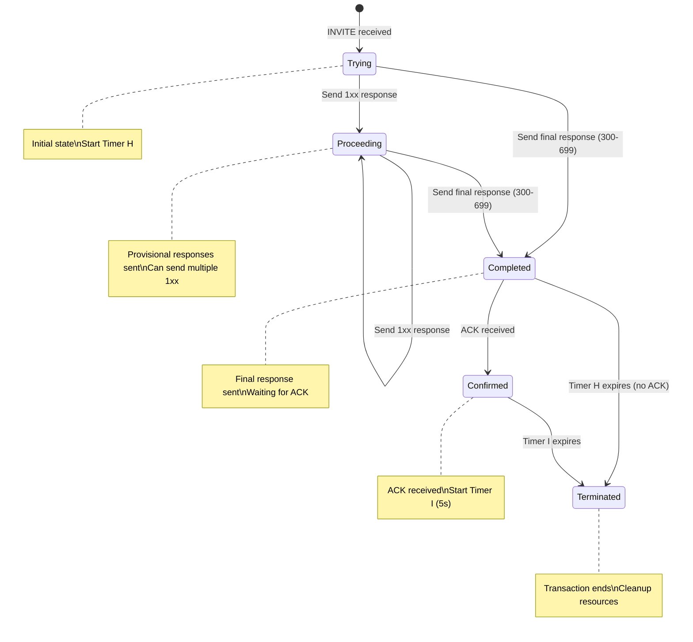
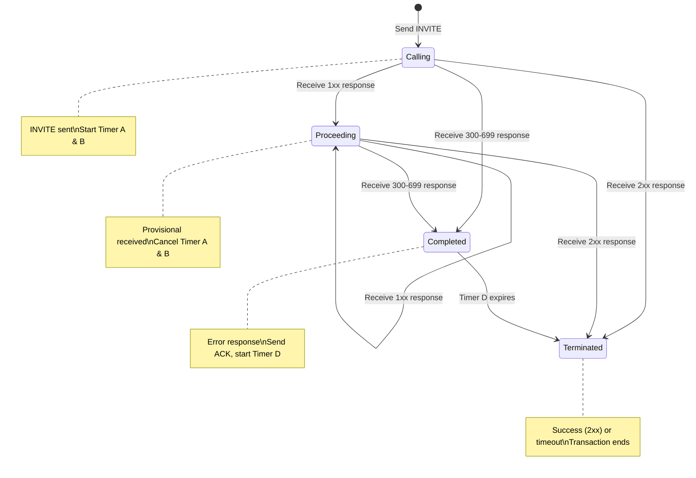
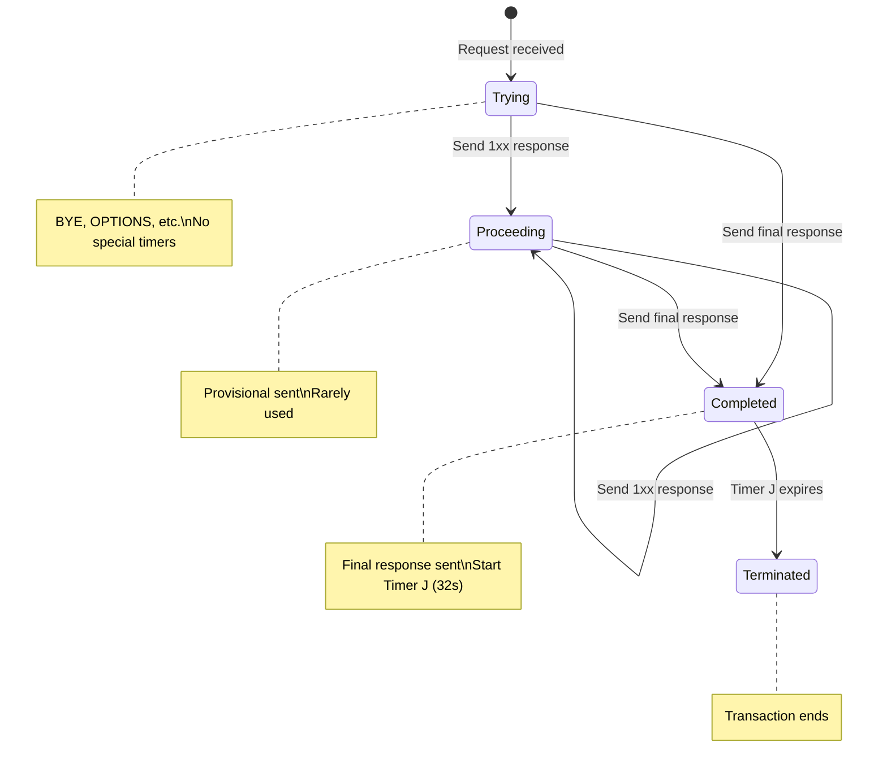
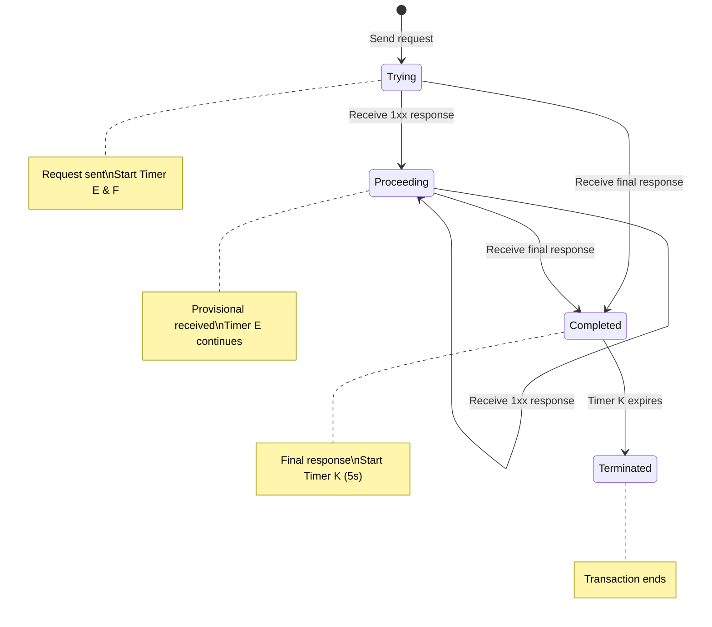
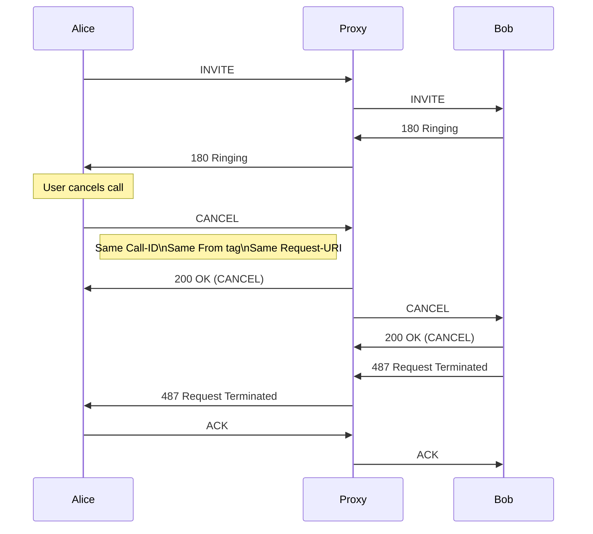
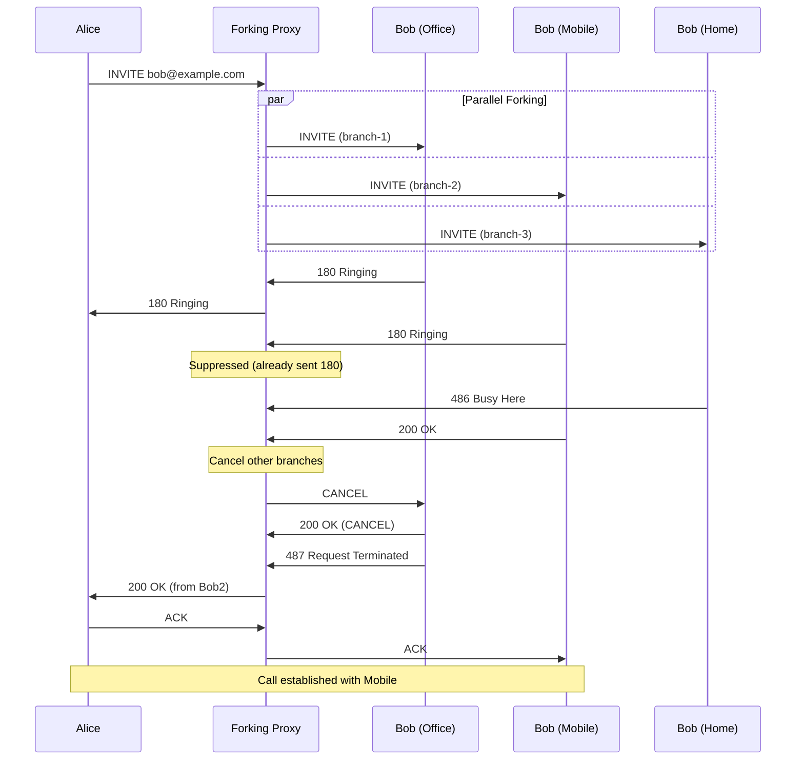
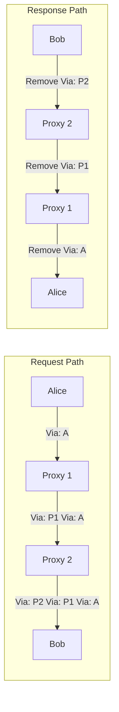
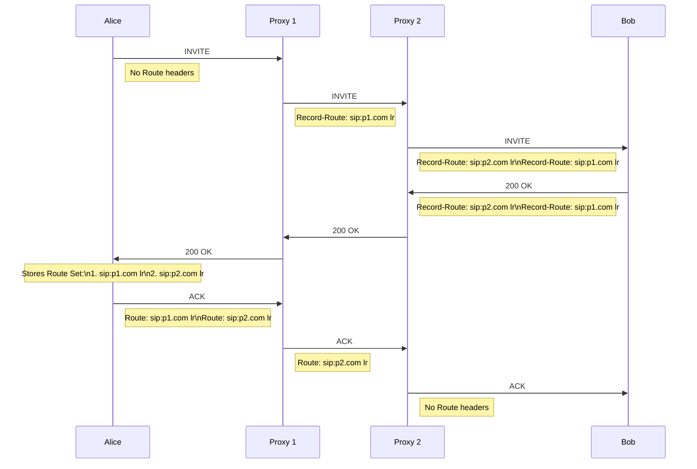

# SIP Basics

This guide provides an introduction to the Session Initiation Protocol (SIP) as implemented in Parrot, following [RFC 3261](https://www.rfc-editor.org/rfc/rfc3261.html), with detailed flow diagrams showing how SIP works in practice.

## What is SIP?

SIP (Session Initiation Protocol) is a signaling protocol used for initiating, maintaining, and terminating real-time sessions that include voice, video and messaging applications. It is defined in [RFC 3261](https://www.rfc-editor.org/rfc/rfc3261.html).

## Basic SIP Call Flow

This flow demonstrates a basic SIP session establishment as described in [RFC 3665 Section 3.1](https://www.rfc-editor.org/rfc/rfc3665.html#section-3.1):

```mermaid
sequenceDiagram
    participant Alice as Alice 192.168.1.100
    participant Proxy as SIP Proxy sip.example.com
    participant Location as Location Service
    participant Bob as Bob 10.0.0.50
    
    Note over Alice: Wants to call bob@example.com
    
    Alice->>Proxy: INVITE sip:bob@example.com
    Note right of Alice: Via: SIP/2.0/UDP 192.168.1.100:5060\nFrom: alice@example.com\nTo: bob@example.com\nCall-ID: 12345@192.168.1.100
    
    Proxy->>Location: Query bob@example.com
    Location->>Proxy: Contact: sip:bob@10.0.0.50
    
    Proxy->>Bob: INVITE sip:bob@10.0.0.50
    Note right of Proxy: Via: SIP/2.0/UDP proxy.example.com\nVia: SIP/2.0/UDP 192.168.1.100:5060\nRecord-Route: sip:proxy.example.com
    
    Bob->>Proxy: 180 Ringing
    Proxy->>Alice: 180 Ringing
    
    Note over Bob: User answers
    
    Bob->>Proxy: 200 OK (+ SDP)
    Note left of Bob: Contact: sip:bob@10.0.0.50\nContent-Type: application/sdp
    
    Proxy->>Alice: 200 OK (+ SDP)
    
    Alice->>Proxy: ACK
    Proxy->>Bob: ACK
    
    Note over Alice,Bob: RTP Media Flow (Direct)
    Alice<->Bob: Voice/Video (RTP)
    
    Note over Alice: Hangs up
    
    Alice->>Proxy: BYE
    Proxy->>Bob: BYE
    Bob->>Proxy: 200 OK
    Proxy->>Alice: 200 OK
```

## SIP Registration Flow

SIP registration is specified in [RFC 3261 Section 10](https://www.rfc-editor.org/rfc/rfc3261.html#section-10):



## SDP Negotiation in Detail

Session Description Protocol (SDP) negotiation follows [RFC 4566](https://www.rfc-editor.org/rfc/rfc4566.html) for SDP format and [RFC 3264](https://www.rfc-editor.org/rfc/rfc3264.html) for offer/answer model:



## SIP Transaction State Machines

These state machines are precisely defined in [RFC 3261 Section 17](https://www.rfc-editor.org/rfc/rfc3261.html#section-17):

### Server Transaction (INVITE)

As specified in [RFC 3261 Section 17.2.1](https://www.rfc-editor.org/rfc/rfc3261.html#section-17.2.1):



### Client Transaction (INVITE)

As specified in [RFC 3261 Section 17.1.1](https://www.rfc-editor.org/rfc/rfc3261.html#section-17.1.1):



### Server Transaction (Non-INVITE)

As specified in [RFC 3261 Section 17.2.2](https://www.rfc-editor.org/rfc/rfc3261.html#section-17.2.2):



### Client Transaction (Non-INVITE)

As specified in [RFC 3261 Section 17.1.2](https://www.rfc-editor.org/rfc/rfc3261.html#section-17.1.2):



## CANCEL Flow

The CANCEL method is defined in [RFC 3261 Section 9](https://www.rfc-editor.org/rfc/rfc3261.html#section-9):



## Forking Proxy Flow

Forking proxy behavior is specified in [RFC 3261 Section 16.7](https://www.rfc-editor.org/rfc/rfc3261.html#section-16.7):



## Early Media Flow

Early media is discussed in [RFC 3960](https://www.rfc-editor.org/rfc/rfc3960.html):

```mermaid
sequenceDiagram
    participant Caller as Caller
    participant PBX as PBX/IVR
    participant Callee as Callee
    
    Caller->>PBX: INVITE
    PBX->>PBX: Start IVR
    
    PBX->>Caller: 183 Session Progress
    Note right of PBX: SDP with media info\na=sendonly
    
    Note over Caller,PBX: Early Media (One-way)
    PBX-->>Caller: RTP (Announcement)
    Note left of PBX: Please wait while\nwe connect your call...
    
    PBX->>Callee: INVITE
    Callee->>PBX: 180 Ringing
    
    Note over Caller,PBX: Early Media continues
    PBX-->>Caller: RTP (Ring tone)
    
    Callee->>PBX: 200 OK
    PBX->>Caller: 200 OK
    
    Caller->>PBX: ACK
    PBX->>Callee: ACK
    
    Note over Caller,Callee: Regular Media (Two-way)
    Caller<->PBX: RTP
    PBX<->Callee: RTP
```

## REFER (Call Transfer) Flow

The REFER method is specified in [RFC 3515](https://www.rfc-editor.org/rfc/rfc3515.html):

```mermaid
sequenceDiagram
    participant A as Alice
    participant B as Bob
    participant C as Carol
    
    Note over A,B: Existing call
    A<->B: RTP Media
    
    Note over B: Bob transfers to Carol
    
    B->>A: REFER sip:carol@example.com
    Note right of B: Refer-To: sip:carol@example.com
    
    A->>B: 202 Accepted
    
    A->>B: NOTIFY
    Note right of A: Event: refer\nSubscription-State: active\nContent-Type: message/sipfrag\nSIP/2.0 100 Trying
    
    B->>A: 200 OK
    
    A->>C: INVITE
    Note right of A: Referred-By: sip:bob@example.com
    
    C->>A: 200 OK
    A->>C: ACK
    
    A->>B: NOTIFY
    Note right of A: Event: refer\nSubscription-State: terminated\nContent-Type: message/sipfrag\nSIP/2.0 200 OK
    
    B->>A: 200 OK
    
    A->>B: BYE
    B->>A: 200 OK
    
    Note over A,C: New call established
    A<->C: RTP Media
```

## SIP Headers Explained

SIP header fields are defined in [RFC 3261 Section 20](https://www.rfc-editor.org/rfc/rfc3261.html#section-20):

### Via Header Path

Via header processing is specified in [RFC 3261 Section 8.1.1.7](https://www.rfc-editor.org/rfc/rfc3261.html#section-8.1.1.7):



### Record-Route and Route Headers

Record-Route mechanism is defined in [RFC 3261 Section 16.6](https://www.rfc-editor.org/rfc/rfc3261.html#section-16.6):



## Using Parrot for SIP

Parrot handles all these complex flows automatically. You simply implement the Handler behavior:

```elixir
defmodule MyHandler do
  @behaviour Parrot.SipHandler
  
  def handle_invite(message, state) do
    # Parrot handles:
    # - Transaction state machines
    # - Retransmissions
    # - Timer management
    # - Response routing
    # - Dialog state
    
    # You handle:
    # - Business logic
    # - Media decisions
    # - User interaction
    
    {:respond, 200, "OK", headers, sdp, state}
  end
end
```

Parrot abstracts the protocol complexity while giving you full control over application behavior.