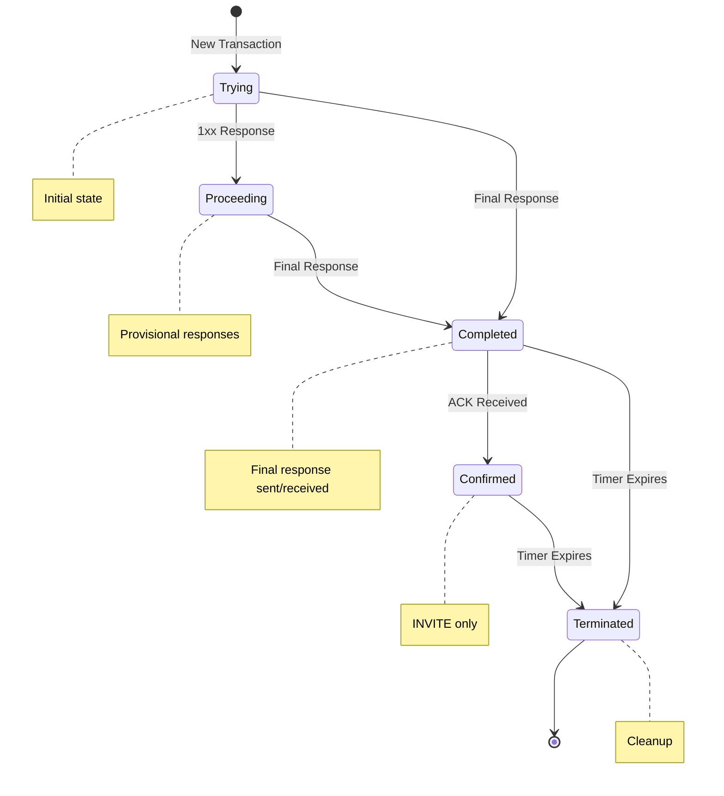
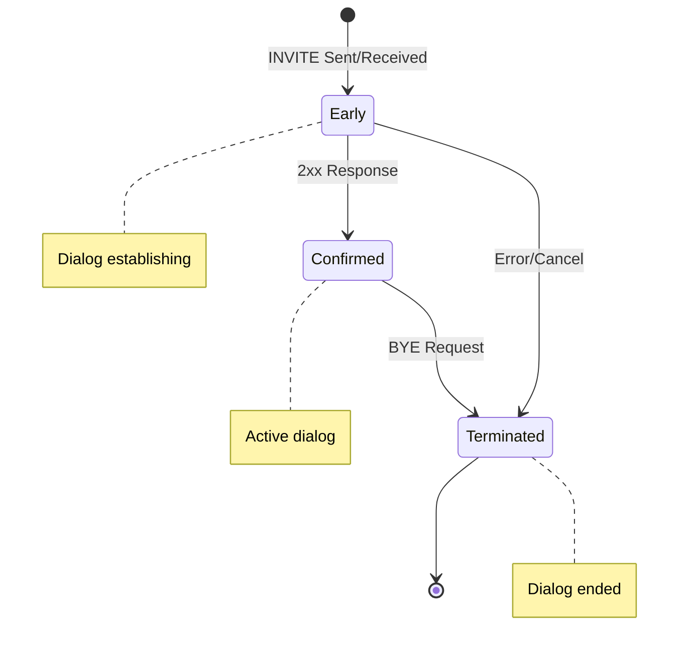
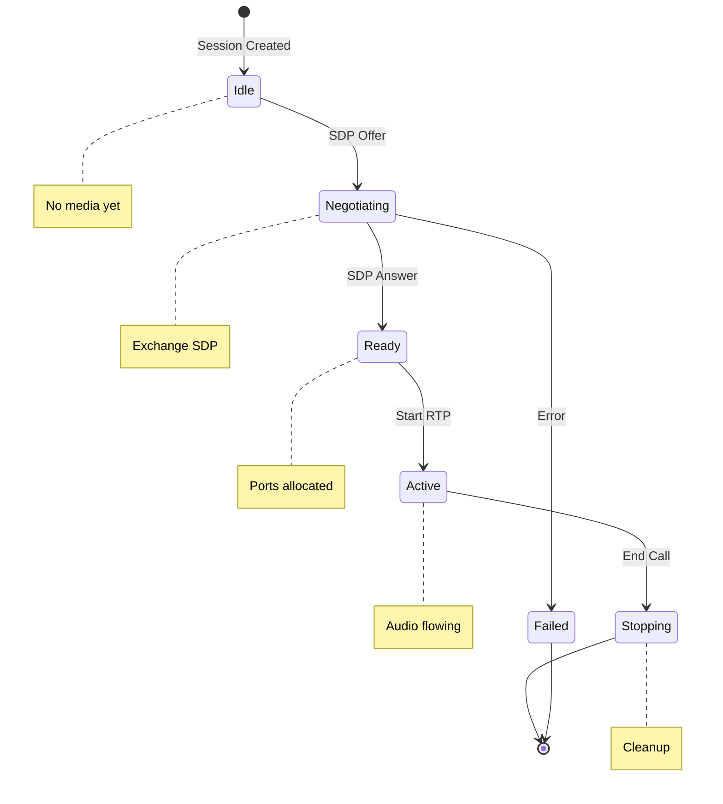

# Parrot Platform State Machines

This guide shows the simplified state machines used in Parrot Platform for handling SIP transactions, dialogs, and media sessions.

## Transaction State Machine

The transaction state machine handles reliable SIP message delivery:

## Dialog State Machine

The dialog state machine manages SIP dialog lifecycle:

## Media Session State Machine

The media session state machine handles audio streaming:

## How They Work Together

1. **Transaction** ensures reliable message delivery
2. **Dialog** maintains the call context
3. **Media** handles the actual audio stream

All three use Erlang's `gen_statem` behavior for robust state management.